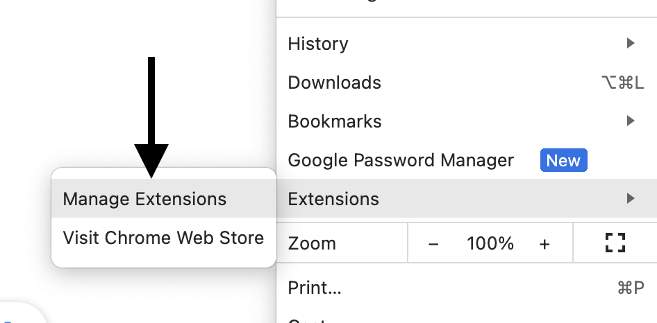
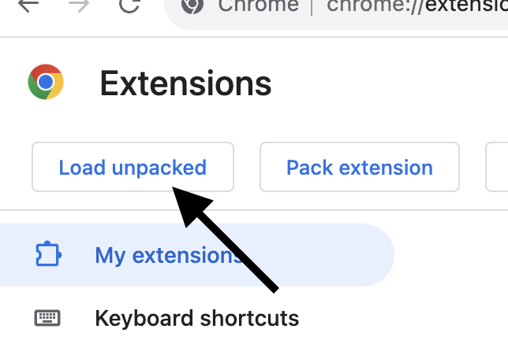

# Zero To Mastery - Extension

Official extension for Zero To Mastery Academy students.

## Features

* Toggle sidebar (responsive)
* Toggle dark mode

## Versions

* v23.12.13
	* Added `underline` in the lecture attachment links
	* Fixed `nav-icon-list:hover` background color in mobile view.
* v23.12.12
	* New feature `Toggle sidebar`
	* New feature `Toggle dark mode`

## Download and install it locally?

1. Download/clone this repo
2. Go to the `Manage Extensions` tab from Chrome

3. Check `Developer Mode` from the right-up side

4. Click the `Load unpacked` button from the left-top side

5. Choose your downloaded repo and click `Select`
6. Go back to your `Zero To Mastery` tab and reload the page
7. Now, you will see our extension loaded

## Suggestions or Issues?

Any new suggestions are welcome. You can suggest here -> [GitHub Suggestion](https://github.com/sithu-khant/ztm-extension/issues)

Feel free to create a new issue here -> [GitHub Issue](https://github.com/sithu-khant/ztm-extension/issues)

(If you are currently a member of the ZTM discord server, you can also suggest/issue there)

## Want to contribue?

If you added any new features, make a pull request. I will review, and merge into the extension if it is fun to have.

## Demos

* Toggle sidebar

* Toggle dark mode

## License

MIT License

## Logs

* Wed Dec 13, 2023 - Version (v23.12.13).
* Tue Dec 12, 2023 - Launched first version (v23.12.12).
* Sun Dec 10, 2023 - Started the project.
