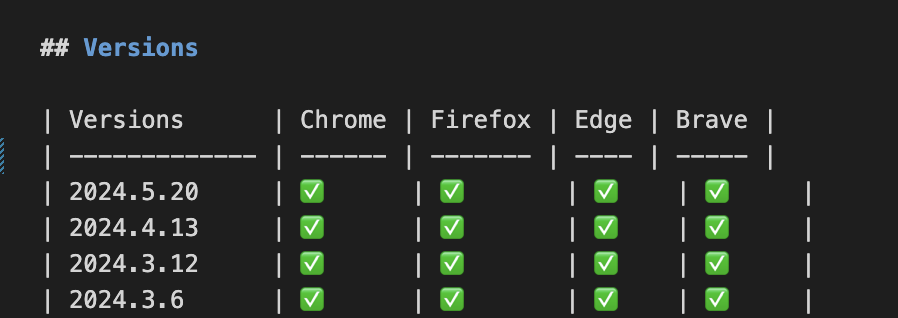
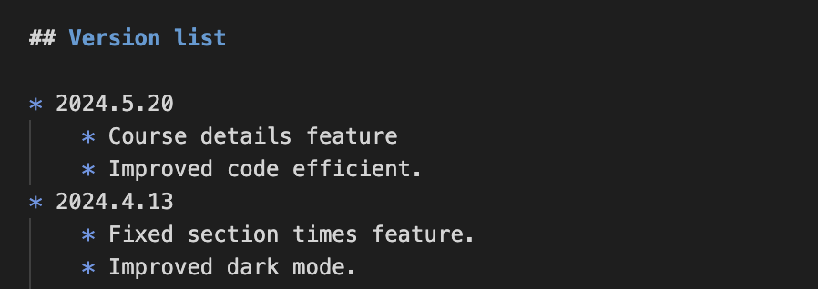
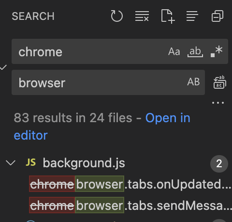
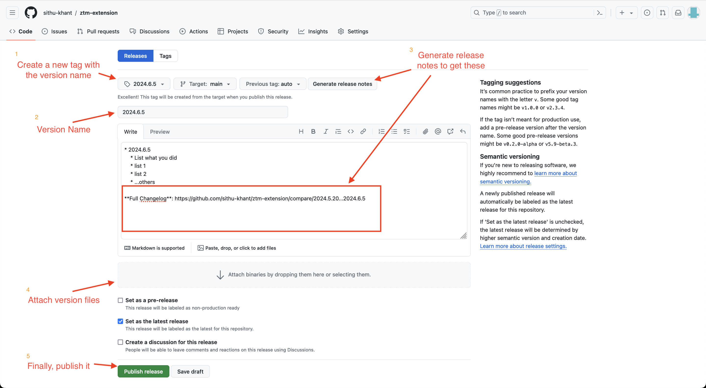

# Updaing Course Details feature and Releasing new version

**Authors:** Sithu Khant

**Last update:** Wed Jun 5, 2024

> **Note:** Create a new branch, please don't on the `main` branch. 
> And make pull requrest.


## To add new course

For example, the new course name is `New Course in 2024: Zero To Mastery` and the link is `https://zerotomastery.io/courses/new-course/`. To add this new course:

Open `course-details.json` and add like this at the bottom of the `course-details.json`
```json
[
  ...others course list,
  {
    "name": "New Course in 2024: Zero To Mastery",
    "link": "https://zerotomastery.io/courses/chatgpt-code-interpreter-guide/"
  }
]
```

That is all!

### Things to note here

You can't add **extra words** in the object of `course-details.json`. 

For example:

|  NAME          | COURSE NAME                                          |
| -------------- | ---------------------------------------------------- |
| Actual name:   | New Course in 2024: Zero To Mastery                  |
| Your name:     | Bla Bla Bla New Course in 2024: Zero To Mastery      |

Becuase how my codes work is that it will loop through every single words of `Your name` and check whether that word contains in the `Actual name` word list.

My code will automatically remove:
* `:`
* `(` and `)`
* years (2024, 2025, ...)
* `in`

**But** you can leave some words in `Your name` string. 

For example:

|  NAME          | COURSE NAME                                          |
| -------------- | ---------------------------------------------------- |
| Actual name:   | Bla Bla Bla New Course in 2024: Zero To Mastery      |
| Your name:     | New Course in 2024: Zero To Mastery                  |

*My advice is better not to leave words. It is okay you leave one or two words. But if it is more than three words, there might be conflict between names.*

## To create a new version

1. Open `manifest.json` file, update `version` name with the current date.
    ```json
    {   
        ...others,
        "version": "2024.6.5",
        ...others,
    }
    ```

2. Add version name under `Versions` table in the `README.md` file
    

3. Add version name and list changes you made under `Version List`
    

### To create Chrome version

Select these files and folders in your file manager

* `background.js`
* `course-details.js`
* `css/`
* `icons/`
* `LICENSE`
* `manifest.json`
* `popup/`

And compress them to create zip file. Rename that file into this format `ztm-extension-chrome-2024.6.5`, `2024.6.5` is the version name.

### To create Firefox version

Extract the **previous zipped file** version. 

> The purpose of doing this is not to confuse with the actual codebase. You should work on the unzipped folder of the chrome version to create the Firefox version.

Open `manifest.json` file:

1. Replace this part:
    ```json
    {
        ...others,
        "background": {
            "service_worker": "background.js"
        },
        ...others
    }
    ```
    with:
    ```json
    {
        ...others,
        "background": {
            "scripts": ["background.js"],
            "service_worker": "background.js"
        },
        ...others
    }
    ```

2. Add this part:
    ```json
    {
        ...others,
        "browser_specific_settings": {
            "gecko": {
                "id": "sithu.khant@tuta.io",
                "strict_min_version": "42.0"
            }
        },
        ...others,
    }
    ```

See the complete `manifest.json` file example here. [Link](./assets/manifest.json)

3. Replece the `chrome` object name with `browser` in every file. 
Tip: if you use VS Code, you can easily replace using the *Search* tab. It will automatically change all the object names.



4. Create `.xpi` zip version.
    * You can install with `brew` if you don't have `7zip`
        ```bash
        brew install p7zip
        ```
    * Open your terminal and type
        ```bash
        7z u ./ztm-extension-firefox.2024.6.5.xpi * -r
        ```
        *Replace `2024.6.5` with the current date.*

5. After you get the `ztm-extension-firefox-2024.6.5.xpi` file, you may delete firefox version folder.

## Add version files (Optional)

I normally added these two new versions (for Firefox and Chrome) into `utils/versions/` folder. Delete the old version files and add that new versions. I encourage you to do the same if you can.

## Push to GitHub

After you finish all the steps, please create a pull request. We will review and merge it.

## Release on GitHub Releases (For Collaborators)

Go to the `Releases` page, click `Draft a new release`, and follow these steps:




