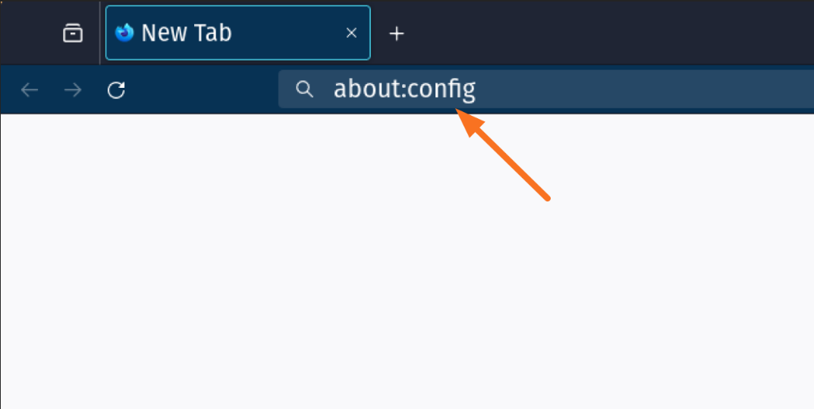
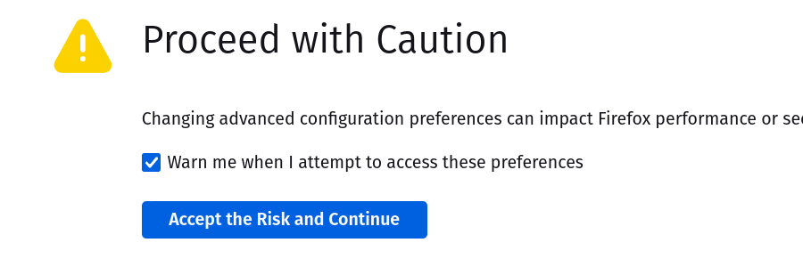
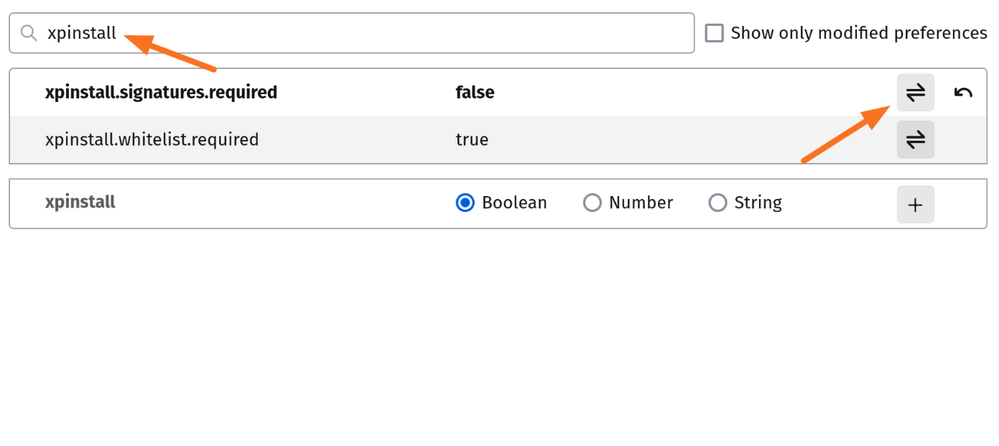
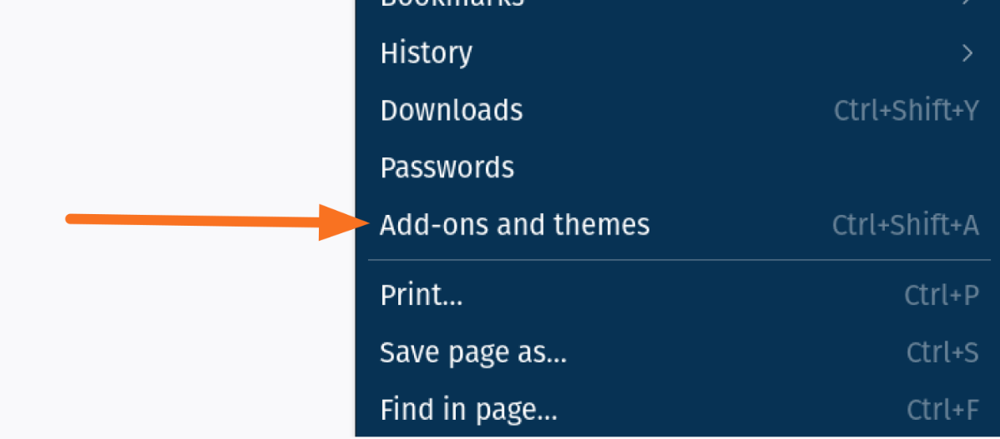
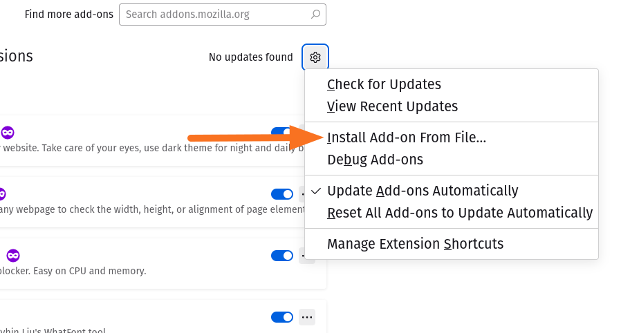
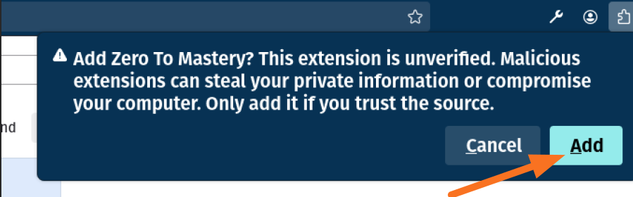
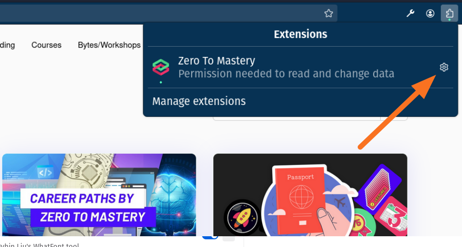

# Installing Extension on Firefox Locally (persistent installations)

**Authors:** Sithu Khant, Raylan Daalman

**Last update:** Wed Feb 14, 2023

## Before Installing

Mozilla currently does not allow unsigned add-ons to be persistently installed in the standard Firefox web browser. If installing as a temporary add-on, then the extension will need to be manually added every time Firefox is closed and re-opened.

The Firefox browsers that allow the installation of unsinged add-ons are:

- Firefox [Extended Support Release (ESR)]([Get Firefox for your enterprise with ESR and Rapid Release](https://www.mozilla.org/en-US/firefox/enterprise/))

- Firefox [Developer Edition]([Firefox Developer Edition](https://www.mozilla.org/firefox/developer/))

- Firefox [Nightly Edition](https://nightly.mozilla.org/)

Before continuing, please install one of these editions of Firefox. For more details, see the article: [Add-on signing in Firefox](https://support.mozilla.org/en-US/kb/add-on-signing-in-firefox)

## Installation

For this example, the version of Firefox being used is: Firefox Developer Edition.

1. Click `Releases` from the right-center

2. Choose the latest version

3. Click the `ztm-extension-firefox-<version>.xpi` to download

4. In the Firefox address bar, type  `about:config`

5. A **Proceed with Caution** message will appear, click `Accept the Risk and Continue`

6. In the searchbar titled **Search preference name**, search for the text `xpinstall.signature.required`, then click the `toggle` icon to change the value from `true` to `false`.

7. Click `Add-ons and themes` from the settings menu.

8. Click `Install Add-on From File...` from the settings icon

9. Choose your downloaded `ztm-extensions-firefox-<version>.xpi` file and click `open`
10. In the warning message asking if the Zero To Mastery add-on should be added, click `Add`

11. Go back to your Zero To Mastery Academy learning page.
12. Click the extension icon from the top-right side and click the setting icon from the Zero To Mastery extension.

13. Click `Always Allow on academy.zerotomastery.io`
14. Reload the page and, you will see your extension loaded.
