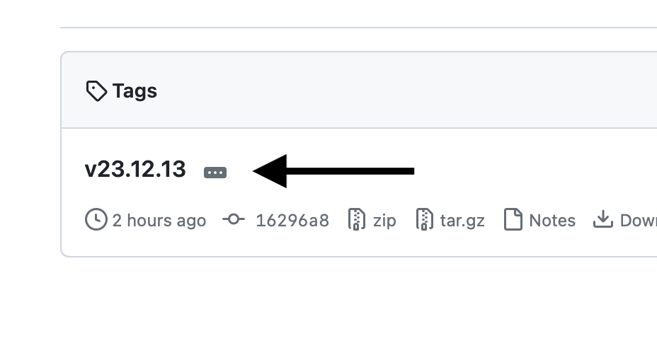
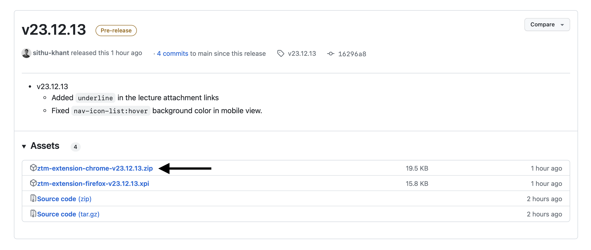

# Installing extension on Firefox locally

**Author:** Sithu Khant
**Last update:** Wed Dec 13, 2023

1. Click `Releases` from the right-center

2. Choose the latest version

3. Click the `ztm-extension-chrome-<version>.zip` to download

4. Extract the downloaded zip file