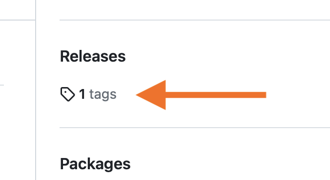
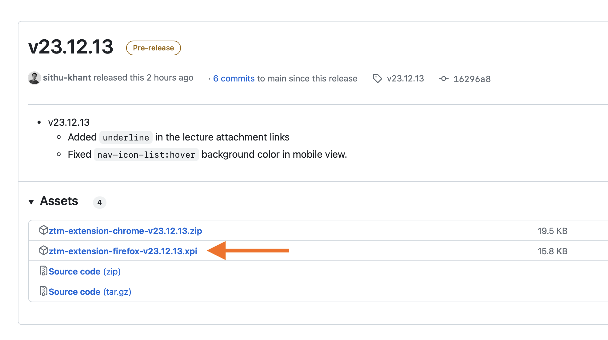
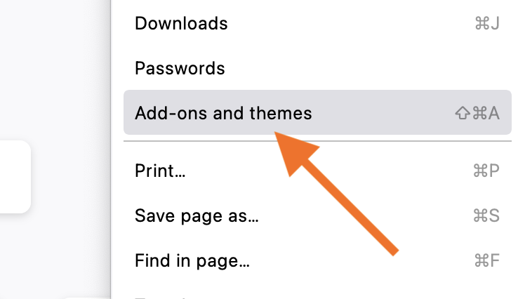
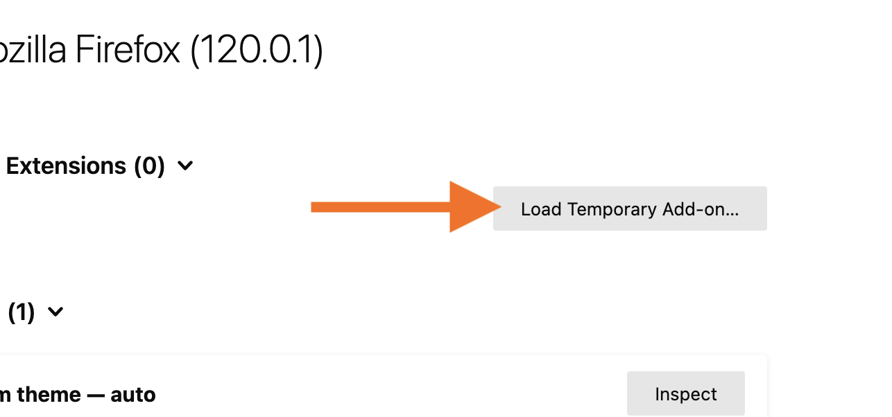
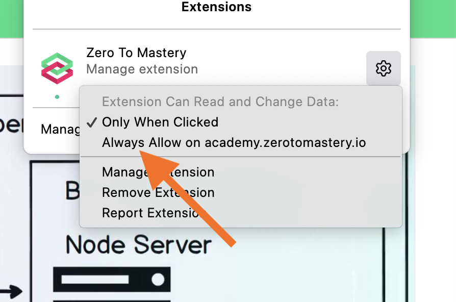

# Installing extension on Firefox locally

**Author:** Sithu Khant

**Last update:** Wed Dec 13, 2023

1. Click `Releases` from the right-center

2. Choose the latest version

3. Click the `ztm-extension-firefox-<version>.xpi` to download

4. Go to the `Add-ons and themes` tab from Firefox

5. Click `Debug Add-ons` from the setting icon

6. Click `Load Temporary Add-on..`

7. Choose your downloaded `ztm-extension-firefox-<version>.xpi` file and click `open`

8. Go back to your Zero To Mastery Academy learning page.

9. Click the extension icon from the top-right side and click setting icon from the Zero To Mastery extension.

10. Click `Always Allow on academy.zerotomastery.io`

11. Reload the page and, you will see our extension loaded

